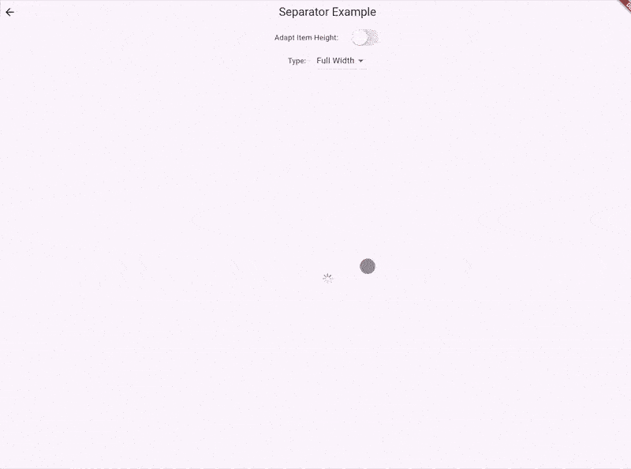
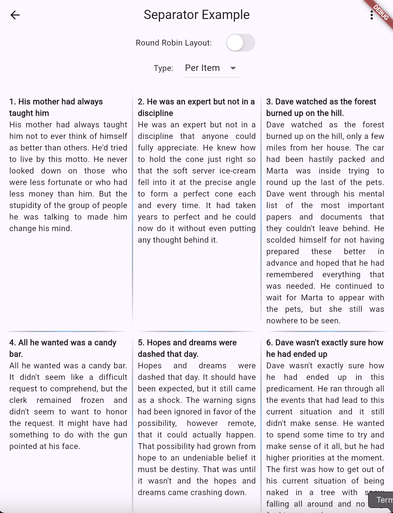
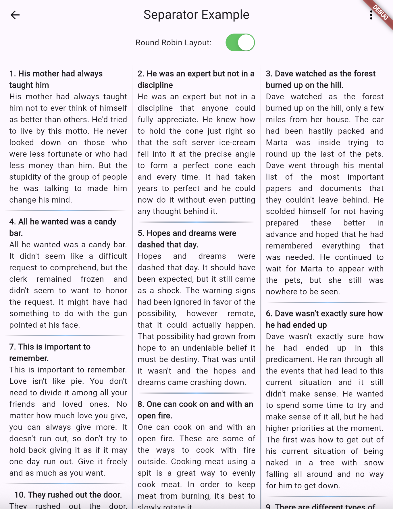

# ResponsiveFlexList

<p align="center">
  <a href="https://pub.dev/packages/responsive_flex_list"></a>
  <a href="https://pub.dev/packages/responsive_flex_list/score"></a>
  <a href="https://pub.dev/packages/responsive_flex_list/score"></a>
  <a href="https://pub.dev/packages/responsive_flex_list/score"></a>
</p>

A responsive and animated Flutter list/grid package with smooth transitions, optional dividers, and full RTL support that adapts effortlessly from single-column lists to multi-column layouts.



## Why ResponsiveFlexList?

- 📱 **Auto-responsive** - ListView on mobile → GridView on desktop
- ✨ **8 built-in animations** - No AnimationController needed
- 🧱 **Masonry layouts** - Instagram/Pinterest style grids
- 🌍 **RTL ready** - Perfect for global apps
- ⚡ **Performant** - Built on Slivers, handles large lists smoothly

## Installation

Add to your `pubspec.yaml`:

```yaml
dependencies:
  responsive_flex_list: <latest>
```

Then run:

```bash
flutter pub get
```

## Getting Started

Initialize the package with your custom breakpoints before use (optional):

```dart
import 'package:flutter/material.dart';
import 'package:responsive_flex_list/responsive_flex_list.dart';

void main() {
  // Optional: Initialize custom breakpoints
  // ResponsiveConfig.init(
  //   breakpoints: Breakpoints.defaultBreakpoints,
  // );

  runApp(const MyApp());
}
```

## Responsive Behavior

Automatically adapts column count based on screen width:

| Screen Size         | Max Width | Default Columns      |
| ------------------- | --------- | -------------------- |
| Small Mobile        | < 320px   | **List** (1 column)  |
| Mobile              | < 480px   | **Grid** (2 columns) |
| Small Tablet        | < 640px   | **Grid** (3 columns) |
| Tablet              | < 820px   | **Grid** (4 columns) |
| Laptop              | < 1024px  | **Grid** (5 columns) |
| Desktop             | < 1280px  | **Grid** (6 columns) |
| Large Desktop       | < 1440px  | **Grid** (7 columns) |
| Extra Large Desktop | ≥ 1920px  | **Grid** (8 columns) |

## Basic Usage

### Simple List to Grid

Single column on phones, multi-column grid on tablets/desktop

```dart
ResponsiveFlexList(
  children: [
    Card(child: ListTile(title: Text('Item 1'))),
    Card(child: ListTile(title: Text('Item 2'))),
    Card(child: ListTile(title: Text('Item 3'))),
  ],
)
```

### Dynamic Data with Builder

```dart
ResponsiveFlexList.builder(
  items: products,
  itemBuilder: (product, index) => ProductCard(
    title: product.name,
    price: product.price,
  ),
  animationType: AnimationType.slideUp,
)
```

### Force List Mode (1 Column)

```dart
ResponsiveFlexList(
  crossAxisCount: 1, // Always list view
  children: items,
)
```

### Force Grid Mode (Fixed Columns)

```dart
ResponsiveFlexList(
  crossAxisCount: 3, // Always 3-column grid
  children: items,
)
```

### Custom Breakpoints

```dart
ResponsiveFlexList.builder(
  items: items,
  itemBuilder: (item, index) => MyCard(item),
  breakpoints: Breakpoints(
    tablet: 900,        // Custom tablet breakpoint
    desktopColumns: 6,  // 6 columns on desktop
    // Other values use defaults
  ),
)
```

## Helper Extensions

Access responsive checks directly from context:

```dart
if (context.isTablet) { ... }
if (context.isMobile) { ... }
final width = context.screenWidth;
```

Define only the breakpoints you need:

```dart
ResponsiveConfig.init(
  breakpoints: Breakpoints.onlyWith(
    mobile: 480,
    desktop: 1024,
  ),
);
// Now context.isTablet, context.isLaptop return false
```

## Built-in Animations

Choose from 8 pre-built animations:

```dart
ResponsiveFlexList(
  children: items,
  animationType: AnimationType.bounce,
  // Options:
  // • none          - No animation (default)
  // • fade          - Gentle fade in
  // • scale         - Scale up from small
  // • slide         - Slide from left/right (RTL aware)
  // • slideUp       - Slide up from bottom
  // • slideDown     - Slide down from top
  // • rotation      - Rotate in (RTL aware)
  // • bounce        - Bouncy entrance
  // • flipIn        - Flip from half-rotation
)
```

### Animation Sequencing

```dart
ResponsiveFlexList(
  children: items,
  animationFlow: AnimationFlow.byRow,
  // Options:
  // • individual    - One by one
  // • byRow         - Row by row
  // • byColumn      - Column by column
  // • simultaneous  - All together (default)
  staggerDelay: Duration(milliseconds: 150),
)
```

## Masonry Layouts

Perfect for photo galleries and content feeds with variable heights.

### Instagram Style

Perfectly replicates Instagram Explore layout

```dart
ResponsiveFlexMasonry.instagram(
  items: photos,
  itemBuilder: (photo, index) => Image.network(
      photo.url,
      fit: BoxFit.cover,
      width: double.infinity,
    ),
  maxRowHeightMultiplier: 1.0, // Adjust if needed
)
```


### Pinterest Style

Pinterest-style masonry with variable heights

```dart
ResponsiveFlexMasonry.pinterest(
  items: products,
  itemBuilder: (product, index) => ProductCard(product),
)
```


## Smart Separators

Add separators that work intelligently across list and grid modes:

```dart
ResponsiveFlexList.withSeparators(
  items: listItems,
  itemBuilder: (item, index) => ListTile(title: Text(item)),

  // Horizontal dividers between rows
  mainAxisSeparator: (rowIndex, totalRows) => Divider(color: Colors.grey),

  // Vertical dividers between columns
  crossAxisSeparator: (columnIndex, totalColumns) => Container(
    width: 1,
    color: Colors.grey[300],
  ),

  // Control divider width behavior
  mainAxisSeparatorMode: SeparatorMode.fullWidth, // or itemWidth

  // Required when displaying vertical dividers
  useIntrinsicHeight: true,
)
```

### Separator Behavior

#### Display Modes

- **List mode (1 column):** Only `mainAxisSeparator` appears between rows (similar to `ListView.separated`)
- **Grid mode (2+ columns):** Both `mainAxisSeparator` (horizontal) and `crossAxisSeparator` (vertical) appear between items.

#### Separator Width Options

- **fullWidth:** Separators span the entire container width (similar to `ListView.separated`)
- **itemWidth:** Separators only appear between individual items.

#### Layout Algorithm

- **roundRobinLayout:** Distributes items sequentially across columns in rotation (1→2→3→1→2→3...)

|                      Item Width Mode                      |              Round Robin Layout               |
| :-------------------------------------------------------: | :-------------------------------------------: |
|  |  |
|              _Separators only between items_              |        _Similar to Newspaper' columns_        |

## API Reference

### Core Properties

| Property                 | Description                                    | Example                                      |
| ------------------------ | ---------------------------------------------- | -------------------------------------------- |
| `crossAxisCount`         | Force a specific number of columns             | `1` = list, `3` = 3-col grid                 |
| `animationType`          | Animation style for item transitions           | `AnimationType.bounce`                       |
| `animationFlow`          | Controls animation sequence                    | `AnimationFlow.byRow`                        |
| `breakpoints`            | Custom breakpoint values                       | `Breakpoints(tablet: 800)`                   |
| `crossAxisSeparator`     | Widget between columns                         | `VerticalDivider(width: 1)`                  |
| `crossAxisSpacing`       | Horizontal spacing between columns             | `8.0`                                        |
| `mainAxisSeparator`      | Widget between rows                            | `Divider(thickness: 1)`                      |
| `mainAxisSeparatorMode`  | How horizontal separators display              | `SeparatorMode.itemWidth`                    |
| `roundRobinLayout`       | Distributes items sequentially across columns  | `true`                                       |
| `mainAxisSpacing`        | Vertical spacing between rows                  | `8.0`                                        |
| `useIntrinsicHeight`     | Match row heights to tallest item in row       | `true`                                       |
| `maxRowHeight`           | Maximum row height constraint (pixels)         | `200.0`                                      |
| `maxRowHeightMultiplier` | Height multiplier for Instagram-style layouts  | `1.5`                                        |
| `onLoadingProgress`      | Callback for Pinterest layout loading progress | `(loaded, total) => print('$loaded/$total')` |
| `staggerDelay`           | Delay between animated items                   | `Duration(milliseconds: 150)`                |
| `maxStaggeredItems`      | Limit animated items for performance           | `50`                                         |

### Context Extensions

| Property              | Description                                  | Range                     |
| --------------------- | -------------------------------------------- | ------------------------- |
| `screenWidth`         | Current screen width                         | `375.0`, `1920.0`         |
| `screenHeight`        | Current screen height                        | `812.0`, `1080.0`         |
| `isSmallMobile`       | Extra small phones                           | < 320px                   |
| `isMobile`            | Standard phones                              | 320px - 480px             |
| `isSmallTablet`       | Large phones / small tablets                 | 480px - 640px             |
| `isTablet`            | Tablets                                      | 640px - 820px             |
| `isLaptop`            | Small laptops                                | 820px - 1024px            |
| `isDesktop`           | Desktop screens                              | 1024px - 1280px           |
| `isLargeDesktop`      | Large desktop screens                        | 1280px - 1440px           |
| `isExtraLargeDesktop` | Extra large desktop screens                  | ≥ 1440px                  |
| `isMobileDevice`      | General mobile check                         | < 480px                   |
| `isTabletDevice`      | General tablet check                         | 640px - 820px             |
| `isDesktopDevice`     | General desktop check                        | ≥ 1024px                  |
| `hasMediaQuery`       | Checks if MediaQuery is available in context | `true` inside widget tree |

> **Note:** Context extensions use breakpoints from `ResponsiveConfig`. If not initialized, they use `Breakpoints.defaultBreakpoints`.

## Contributing

Contributions are welcome! Please feel free to submit a Pull Request.

1. Fork the repository
2. Create your feature branch (`git checkout -b feature/AmazingFeature`)
3. Commit your changes (`git commit -m 'Add some AmazingFeature'`)
4. Push to the branch (`git push origin feature/AmazingFeature`)
5. Open a Pull Request

## License

This project is licensed under the MIT License - see the [LICENSE](LICENSE) file for details.

## Support

- 🐛 [Report Issues](https://github.com/awais305/responsive_flex_list/issues)
- ⭐ [Star on GitHub](https://github.com/awais305/responsive_flex_list)
- 💬 [Discussions](https://github.com/awais305/responsive_flex_list/discussions)
