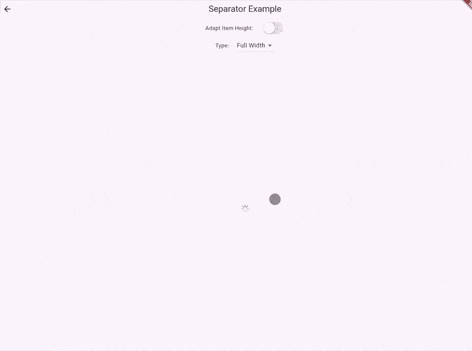
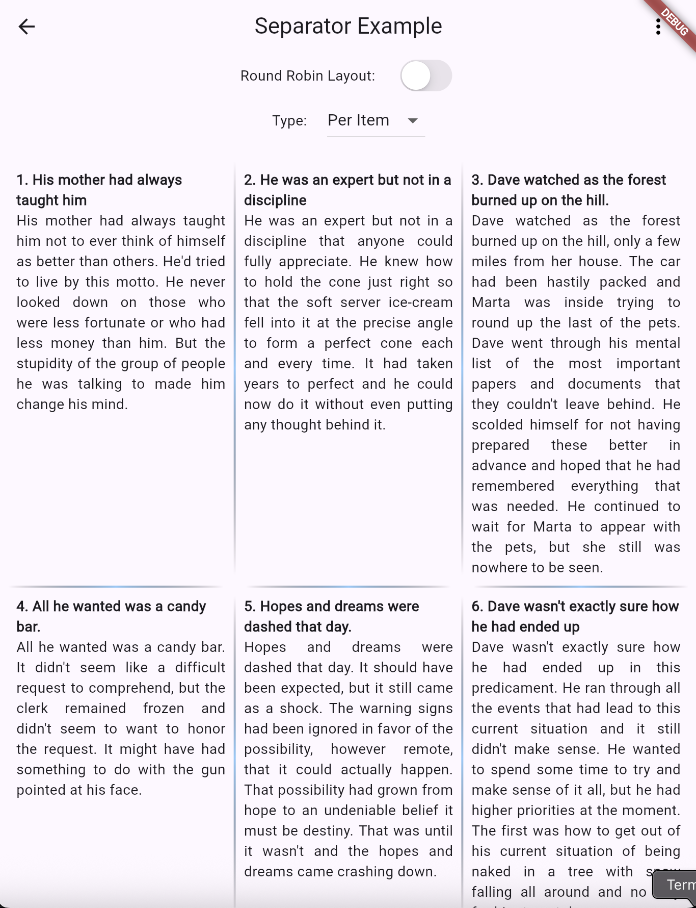
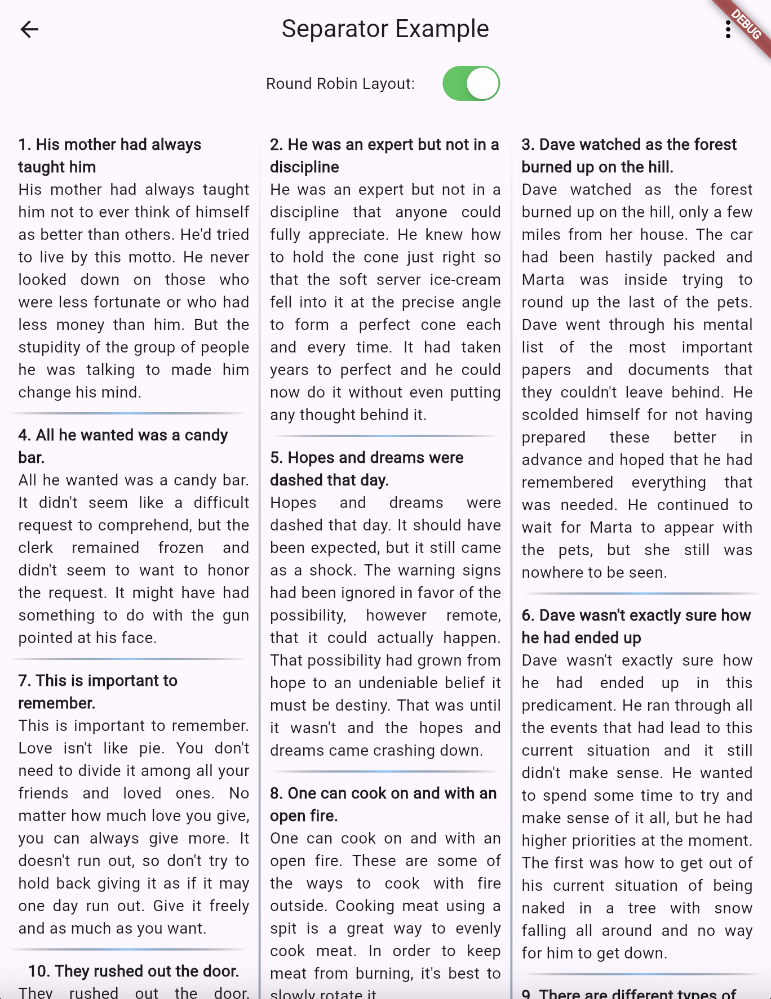

# ResponsiveFlexList

Responsive Flutter list, grid, and masonry layouts with animations, separators, breakpoints, and RTL-aware behavior.

<p align="center">
  <a href="https://pub.dev/packages/responsive_flex_list"></a>
  <a href="https://pub.dev/packages/responsive_flex_list/score"></a>
  <a href="https://pub.dev/packages/responsive_flex_list/score"></a>
</p>

`responsive_flex_list` helps you build adaptive Flutter layouts that change from a single-column list to a multi-column grid or masonry layout based on available width. It is useful for mobile, tablet, desktop, and Flutter web screens where you do not want to repeat `ListView`, `GridView`, `LayoutBuilder`, and breakpoint logic in every view.

Use it for Flutter responsive lists, Flutter responsive grids, list-to-grid layouts, responsive dashboard cards, Pinterest-style masonry, Instagram-style masonry, and other adaptive Flutter layouts.



## Features

- Responsive list-to-grid layout: single-column on small screens, multi-column on larger screens.
- Standard list/grid modes are sliver-based for efficient scrolling.
- Builder and children APIs for static or dynamic data.
- Built-in item animations and animation sequencing.
- Smart separators for list and grid modes.
- Custom breakpoints and column limits.
- RTL-aware layout and animation options.
- Instagram-style and Pinterest-style masonry layouts.

## Install

```yaml
dependencies:
  responsive_flex_list: <latest-version>
```

```bash
flutter pub get
```

```dart
import 'package:responsive_flex_list/responsive_flex_list.dart';
```

Optional global breakpoints:

```dart
void main() {
  ResponsiveConfig.init(
    breakpoints: Breakpoints.defaultBreakpoints,
  );

  runApp(const MyApp());
}
```

## When To Use It

Use `responsive_flex_list` when you need:

- A list on small screens and a grid on larger screens.
- A responsive Flutter grid for mobile, tablet, desktop, or web.
- Cleaner responsive UI code without repeating `LayoutBuilder`.
- Smart separators that work in both list and grid modes.
- Built-in item animations without managing `AnimationController`.
- Masonry layouts for galleries, feeds, dashboards, listings, or portfolio grids.
- RTL-aware behavior for Arabic, Persian, Urdu, or other right-to-left interfaces.

## When Not To Use It

You may not need this package if you only need a fixed `ListView`, a basic fixed-column `GridView`, or a layout that never changes across screen sizes.

Use caution with very large dynamic-height masonry collections. Pinterest masonry intentionally prebuilds and measures children to keep item positions stable, so it is not a lazy masonry layout.

Avoid `useIntrinsicHeight` for large grids unless matching row heights is more important than layout cost.

## Why Not Just Use GridView?

Flutter's `GridView` is great when you already know the exact grid structure. `responsive_flex_list` is useful when one screen needs to adapt across widths with one API.

| Need                                          | Flutter default approach     | With ResponsiveFlexList |
| --------------------------------------------- | ---------------------------- | ----------------------- |
| List on small screens, grid on larger screens | Manual `LayoutBuilder` logic | Built in                |
| Fixed grid                                    | `GridView`                   | Supported               |
| Masonry / Pinterest-style layout              | Custom layout/package        | Built in                |
| Animated item appearance                      | Manual animation setup       | Built in                |
| Separators in list and grid                   | Manual layout handling       | Built in                |
| Custom breakpoints                            | Manual width checks          | Built in                |
| RTL-aware animations                          | Manual direction checks      | Built in                |

## Basic Usage

### Dynamic List To Grid

```dart
ResponsiveFlexList.builder(
  itemCount: products.length,
  itemBuilder: (context, index) {
    final product = products[index];
    return ProductCard(product: product);
  },
)
```

### Static Children

```dart
ResponsiveFlexList(
  children: dashboardCards
      .map((card) => DashboardCard(data: card))
      .toList(),
)
```

### Fixed Columns Or Hard Column Limits

```dart
ResponsiveFlexList.builder(
  itemCount: items.length,
  itemBuilder: (context, index) => GalleryImageCard(items[index]),
  gridDelegate: const ResponsiveFlexGridDelegate(
    // Column count will never go below 2 or above 4.
    minCrossAxisCount: 2,
    maxCrossAxisCount: 4,
  ),
)
```

`minCrossAxisCount` and `maxCrossAxisCount` are hard boundaries. Responsive breakpoints still choose the column count, but the final value is clamped inside this range. Use `crossAxisCount` when you want one fixed column count.

### Separators

```dart
ResponsiveFlexList.withSeparators(
  itemCount: settings.length,
  itemBuilder: (context, index) => SettingTile(settings[index]),
  mainAxisSeparator: (rowIndex, totalRows) => const Divider(),
  crossAxisSeparator: (columnIndex, totalColumns) => const VerticalDivider(),
  useIntrinsicHeight: true,
)
```

In list mode, only row separators are shown. In grid mode, row and column separators can both be used. `crossAxisSeparator` is optional; provide it only when you need vertical dividers between columns.

## Breakpoints

Default breakpoints use lower-bound semantics. For example, `desktop: 1024` applies from `1024px` up to, but not including, the next defined breakpoint.

| Screen Size         | Width Range            | Default Columns |
| ------------------- | ---------------------- | --------------- |
| Small Mobile        | < 480px                | 1               |
| Mobile              | >= 480px and < 640px   | 2               |
| Small Tablet        | >= 640px and < 768px   | 3               |
| Tablet              | >= 768px and < 820px   | 4               |
| Laptop              | >= 820px and < 1024px  | 5               |
| Desktop             | >= 1024px and < 1440px | 6               |
| Large Desktop       | >= 1440px and < 1920px | 7               |
| Extra Large Desktop | >= 1920px              | 8               |

Per-widget override:

```dart
ResponsiveFlexList.builder(
  itemCount: items.length,
  itemBuilder: (context, index) => MyCard(items[index]),
  breakpoints: Breakpoints(
    desktop: 1100,
    desktopColumns: 6,
  ),
)
```

## Context Extensions

```dart
if (context.isDesktop) {
  // Desktop-specific UI
}

final width = context.screenWidth;
```

Context extensions read the latest `ResponsiveConfig.breakpoints`. Breakpoints omitted with `Breakpoints.onlyWith(...)` make the matching helper return `false`.

## Animations

```dart
ResponsiveFlexList.builder(
  itemCount: items.length,
  itemBuilder: (context, index) => MyCard(items[index]),
  animationType: AnimationType.slideUp,
  animationFlow: AnimationFlow.byRow,
  staggerDelay: const Duration(milliseconds: 80),
)
```

Animation types include `none`, `fade`, `scale`, `slide`, `slideUp`, `slideDown`, `rotation`, `bounce`, and `flipIn`.

## Masonry Layouts

### Instagram Style

Inspired by Instagram Explore-style row patterns. Good for photo galleries and explore-style layouts. This mode enforces a minimum of 3 columns.

```dart
ResponsiveFlexMasonry.instagram(
  itemCount: photos.length,
  itemBuilder: (context, index) {
    return Image.network(
      photos[index].url,
      fit: BoxFit.cover,
      width: double.infinity,
    );
  },
)
```

### Pinterest Style

Pinterest-style masonry supports variable item heights and enforces a minimum of 2 columns.

```dart
ResponsiveFlexMasonry.pinterest(
  itemCount: products.length,
  itemBuilder: (context, index) => ProductCard(products[index]),
)
```

|             Responsive Instagram Screen              |             Responsive Pinterest Screen              |
| :--------------------------------------------------: | :--------------------------------------------------: |
|  |  |

Pinterest masonry is intentionally non-lazy: it prebuilds and measures children so item positions remain stable while scrolling and while dragging the scrollbar thumb. This avoids visible reflow or jumping that can happen in some lazy staggered layouts.

Tradeoff: higher initial work and memory use. Recommended for small to medium collections, roughly 100-150 lightweight items depending on item complexity and device performance.

`cacheChildren` defaults to `true`, which preserves built item widgets across parent rebuilds. Set it to `false` only when your Pinterest item widgets must rebuild on every parent rebuild.

## Smart Separators

Add separators that work intelligently across list and grid modes:

```dart
ResponsiveFlexList.withSeparators(
  itemCount: listItems.length,
  itemBuilder: (context, index) {
    final item = listItems[index];
    return ListTile(title: Text(item));
  },

  // Horizontal dividers between rows
  mainAxisSeparator: (rowIndex, totalRows) => Divider(color: Colors.grey),

  // Vertical dividers between columns
  crossAxisSeparator: (columnIndex, totalColumns) => Container(
    width: 1,
    color: Colors.grey[300],
  ),

  // Control divider width behavior
  mainAxisSeparatorMode: MainAxisSeparatorMode.fullWidth, // or itemWidth

  // Required when displaying vertical dividers
  useIntrinsicHeight: true,
)
```

### Separator Behavior

#### Display Modes

- **List mode (1 column):** Only `mainAxisSeparator` appears between rows (similar to `ListView.separated`)
- **Grid mode (2+ columns):** Both `mainAxisSeparator` (horizontal) and `crossAxisSeparator` (vertical) appear between items.

#### Separator Width Options

- **fullWidth:** Separators span the entire container width (similar to `ListView.separated`)
- **itemWidth:** Separators only appear between individual items.

#### Layout Algorithm

- **roundRobinLayout:** Distributes items sequentially across columns in rotation (1→2→3→1→2→3...)

|                      Item Width Mode                      |              Round Robin Layout               |
| :-------------------------------------------------------: | :-------------------------------------------: |
|  |  |
|              _Separators only between items_              |        _Similar to Newspaper' columns_        |

## API Snapshot

| API                                      | Use                                                  |
| ---------------------------------------- | ---------------------------------------------------- |
| `ResponsiveFlexList(...)`                | Responsive layout from a list of children            |
| `ResponsiveFlexList.builder(...)`        | Responsive layout for dynamic data                   |
| `ResponsiveFlexList.withSeparators(...)` | List/grid layout with row and column separators      |
| `ResponsiveFlexMasonry.instagram(...)`   | Instagram-style masonry rows                         |
| `ResponsiveFlexMasonry.pinterest(...)`   | Pinterest-style variable-height masonry              |
| `ResponsiveFlexGridDelegate`             | Grid columns, spacing, childAspectRatio, and mainAxisExtent |
| `ResponsiveMasonryGridDelegate`          | Masonry layout column counts and spacing configuration |
| `Breakpoints`                            | Width thresholds and column counts                   |
| `ResponsiveConfig.init(...)`             | Global breakpoint configuration                      |

Legacy parameters such as `crossAxisCount`, `mainAxisSpacing`, and `crossAxisSpacing` are supported for compatibility, but new code should prefer `gridDelegate`. Both `ResponsiveFlexGridDelegate` and `ResponsiveMasonryGridDelegate` inherit from abstract `ResponsiveGridDelegate`. Masonry layouts derive item height from content/pattern rules and do not use `childAspectRatio` or `mainAxisExtent`.

## Performance Notes

Standard list, children, and separator layouts are sliver-based and suitable for large lists when item widgets are lightweight.

Pinterest masonry is intentionally non-lazy. It builds and measures all children so item positions stay stable during scrolling and scrollbar dragging. This is best for bounded galleries and feeds, not unbounded infinite scrolling. For heavy item widgets, keep the collection small, disable expensive animations, and consider `cacheChildren: false` when items must rebuild from changing external state.

`useIntrinsicHeight` can be expensive because Flutter must do extra measurement work. Prefer fixed heights, `mainAxisExtent`, or natural child sizing for large lists.

`shrinkWrap: true` is useful inside another scrollable, but it increases layout work. Use it only when the parent layout requires it.

## Common Mistakes

- Using Pinterest masonry for thousands of dynamic-height items. Use it for bounded collections.
- Enabling `useIntrinsicHeight` on large grids. Prefer fixed or natural item heights.
- Passing both legacy spacing/count parameters and `gridDelegate`. The delegate wins; prefer one style.
- Expecting `crossAxisSeparator` to appear in one-column list mode. It only matters when there are multiple columns.
- Treating breakpoint helpers as device detection. Helpers such as `context.isDesktopRange` are width-range checks.

## Migration From 1.3.x

- Replace `cacheExtent` with `scrollCacheExtent`.
- Default desktop breakpoints now use lower-bound semantics: desktop starts at `1024px`, large desktop at `1440px`, and extra-large desktop at `1920px`.
- Prefer `ResponsiveFlexGridDelegate` over direct layout parameters such as `crossAxisCount`, `mainAxisSpacing`, and `crossAxisSpacing`.
- `ResponsiveFlexList.withSeparators` no longer requires `crossAxisSeparator`; existing code that passes one continues to work.

## Comparison

| Tool                      | Best for                                                      | Tradeoff                            |
| ------------------------- | ------------------------------------------------------------- | ----------------------------------- |
| `ListView`                | Fixed one-column scrolling lists                              | No responsive column changes        |
| `GridView` / `SliverGrid` | Known fixed or adaptive grids                                 | You write breakpoint logic yourself |
| `LayoutBuilder`           | Fully custom responsive behavior                              | More repeated code per screen       |
| `responsive_flex_list`    | List-to-grid, separators, simple breakpoints, bounded masonry | Less control than custom slivers    |

## FAQ

### Is ResponsiveFlexList a replacement for GridView?

Not exactly. `GridView` is still good for fixed grids. `responsive_flex_list` is useful when one layout needs to adapt from list to grid or masonry based on screen width.

### Does it work on Flutter web?

Yes. It is useful for Flutter web, desktop, tablet, and mobile layouts where column count should adapt to available width.

### Does it support masonry layouts?

Yes. Use `ResponsiveFlexMasonry.instagram` for Instagram Explore-style row patterns or `ResponsiveFlexMasonry.pinterest` for Pinterest-style layouts with variable item heights.

### Is Pinterest masonry lazy?

No. Pinterest masonry intentionally prebuilds and measures children to keep item positions stable during scrolling. This improves visual stability but makes it better suited for small to medium collections.

### Can I force or limit column count?

Yes. Use `ResponsiveFlexGridDelegate` or `ResponsiveMasonryGridDelegate` (`crossAxisCount`, `minCrossAxisCount`, `maxCrossAxisCount`).

### Does it support RTL layouts?

Yes. It supports RTL-aware layout and animation behavior for Arabic, Persian, Urdu and other right-to-left interfaces.

## License

MIT. See [LICENSE](LICENSE).

## Links

- [GitHub](https://github.com/awais305/responsive_flex_list)
- [Issues](https://github.com/awais305/responsive_flex_list/issues)
